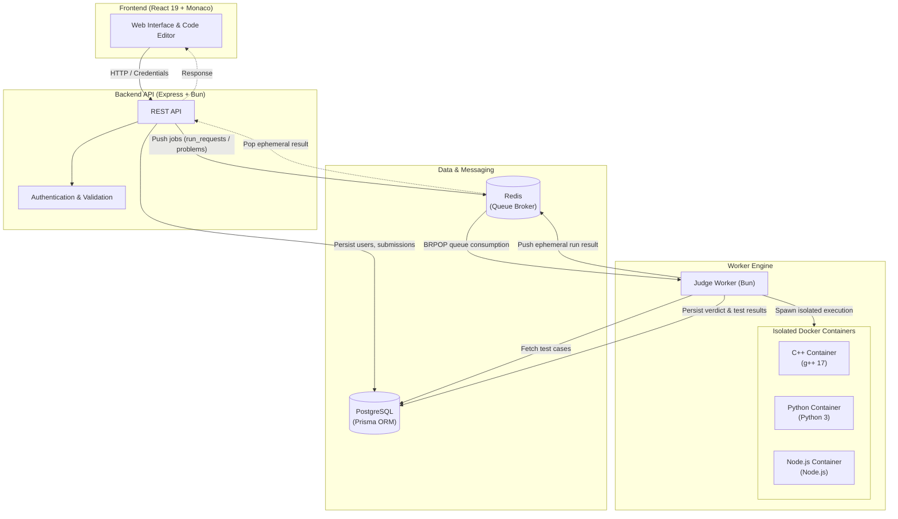

# LeetCode Clone: Distributed Online Judge

A full-stack, distributed online coding judge platform built as a TypeScript monorepo using Bun, Turborepo, Docker, and Redis. The platform provides code editing, automated test execution, and isolated code evaluation.

---

## System Architecture

The application adopts an asynchronous, queue-based architecture to decouple web request handling from compute-intensive code execution.



### Execution Workflow

1. **Interactive Code Run:** The client transmits code with sample or custom test cases. The API server enqueues a job into `run_requests` and awaits an ephemeral response on `run_results:<runId>` using Redis `BRPOP` with a timeout.
2. **Problem Submission:** The API server stores a pending submission record in PostgreSQL and pushes the job onto the `problems` queue. The worker executes all test cases, evaluates the final verdict, and writes detailed test case results back to PostgreSQL.
3. **Execution Sandboxing:** User code executes inside isolated, ephemeral Docker containers configured with strict resource boundaries.

---

## Sandboxing and Security Controls

User-submitted code is untrusted and executes inside locked-down Docker containers with defense-in-depth isolation:

| Security Control | Configuration | Rationale |
| :--- | :--- | :--- |
| **Network Isolation** | `--network=none` | Disables outbound network access, preventing SSRF and reverse shells |
| **Memory Limit** | `--memory 128m` | Prevents memory exhaustion attacks (OOM denial-of-service) |
| **CPU Quota** | `--cpus 0.5` | Limits CPU usage to prevent CPU starvation |
| **Process Cap** | `--pids-limit 64` | Mitigates fork bombs and process table exhaustion |
| **Filesystem Safety** | `--read-only` | Enforces an immutable container filesystem |
| **Temporary Scratch Space** | `--tmpfs /tmp:size=64m,exec` | Provides an ephemeral 64MB ramdisk for source compilation |
| **Privilege Escalation** | `--security-opt=no-new-privileges` | Blocks setuid binaries and privilege escalation exploits |
| **Execution Timeout** | `5000ms (TLE)` | Forcefully terminates hanging processes via SIGKILL |

Supported execution runtimes: **C++ (C++17)**, **Python (Python 3)**, and **JavaScript (Node.js)**.

---

## Project Structure

```
leetcode/
├── apps/
│   ├── frontend/          # React 19, Monaco Editor, Tailwind CSS, Bun server
│   ├── backend/           # Express REST API, JWT auth, Redis producer
│   └── worker/            # Execution worker consuming Redis queues and managing Docker
├── packages/
│   ├── db/                # Prisma ORM schema, migrations, and seed scripts
│   └── typescript-config/ # Shared TypeScript configurations
├── docker-compose.yml     # PostgreSQL 16 and Redis 7 service definitions
└── turbo.json             # Turborepo task pipeline configuration
```

---

## Getting Started

### Prerequisites
- [Bun](https://bun.sh/) (v1.2+)
- [Docker](https://www.docker.com/) and Docker Compose

### Setup Instructions

1. **Clone the repository and install dependencies:**
   ```bash
   git clone https://github.com/JatinSharma222/Leetcode.git
   cd Leetcode
   bun install
   ```

2. **Configure environment variables:**
   ```bash
   cp .env.example .env
   ```

3. **Start infrastructure services (PostgreSQL and Redis):**
   ```bash
   docker compose up -d
   ```

4. **Build sandbox container images:**
   ```bash
   cd apps/worker/docker
   bash build-images.sh
   cd ../../..
   ```

5. **Apply database migrations and seed problems:**
   ```bash
   bun run db:migrate
   bun run db:seed
   ```

6. **Start all services:**
   ```bash
   bun run dev
   ```

   Individual components can also be run independently:
   - Frontend (`http://localhost:3000`): `bun run dev:frontend`
   - Backend API (`http://localhost:3001`): `bun run dev:backend`
   - Judge Worker: `bun run dev:worker`

---

## Available Scripts

| Command | Action |
| :--- | :--- |
| `bun run dev` | Starts frontend, backend, and worker concurrently |
| `bun run build` | Builds all packages and services |
| `bun run db:migrate` | Applies pending Prisma database migrations |
| `bun run db:seed` | Seeds database with initial problem set and test cases |
| `bun run db:studio` | Launches Prisma Studio GUI |

---

## Tech Stack

- **Runtime and Tooling:** Bun, Turborepo, TypeScript
- **Frontend:** React 19, Monaco Editor, Tailwind CSS, Radix UI
- **Backend:** Express, Redis Client, JSON Web Tokens (JWT), Zod
- **Judge Engine:** Docker CLI / Engine Sandboxing, Redis Lists (`LPUSH` / `BRPOP`)
- **Database:** PostgreSQL 16, Prisma ORM
